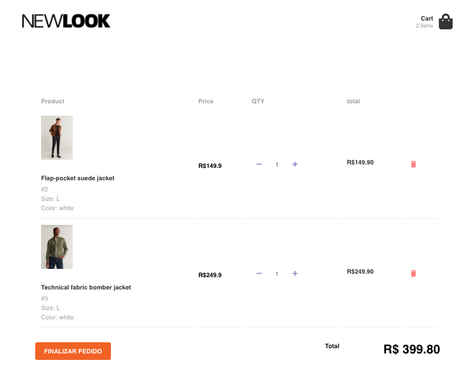

## Project shots :)

In order to run this project, you must:

## yarn install
To install project dependencies on package.json

## json-server server.json -p 3333 -w
To start a fake API with some products on it

## yarn start
To run this project :)

